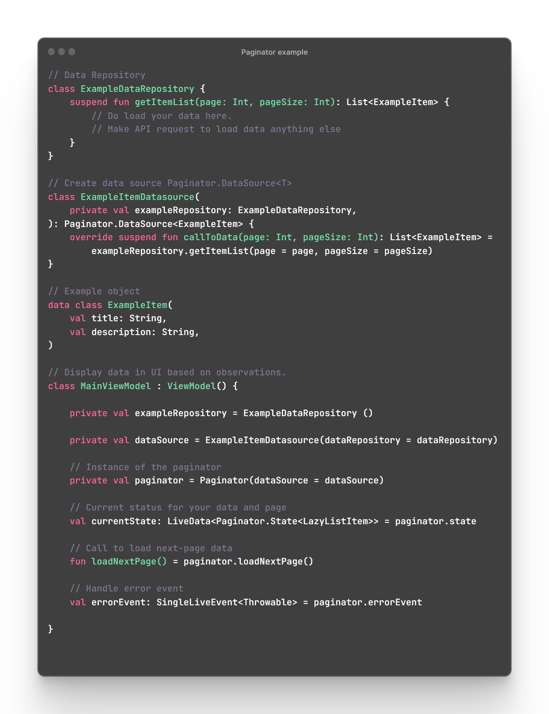

<div align="center">
	
</div>

<h2 align="center">Custom Paginator Demonstration Android Project in Jetpack Compose using Coroutine
and Flow</h2>

<h2 align="center">Overview</h2>
<div align="center">
A sample project demonstrating implementing a Custom Paginator for Android (Jetpack Compose) using
Kotlin Coroutine and Flow. The paginator enables to load data incrementally and paginate it as they
scroll through a list.
</div>

<h2 align="center">Project Structure</h2>
<div align="start">The project has the following key components</div>

* [Paginator](app/src/main/java/com/mrkazofficial/paginator/compose/Paginator.kt) - The main class
  of paginator, no need to write an essay in here! Simply press the **Paginator** and see what is
  there!
    * **DataSource**: A data source interface to fetch data in a paginated manner.
    * **State**: Represents the state of a data loading operation with optional generic items.

> **Note**:
> This method proved effective for me when using API requests with dependency injection. Feel free to try and kindly pull a issue if you experience any issues.


<h2 align="center">Usage</h2>

### Repository
```kotlin
// Creating a repository to load data, you have the option or 
// using your preferred method.
class ExampleRepository {
  suspend fun getItemList(page: Int, pageSize: Int): List<ExampleListItem> {
      /* LOAD DATA */
  }
}
```

### Creating DataSource
```kotlin
// To create a data source, use Paginator.DataSource<T> 
// and specify the type of object you want to use.
class ExampleDatasource(
    private val exampleRepository: ExampleRepository,
) : Paginator.DataSource<ExampleListItem> {
    override suspend fun callToData(page: Int, pageSize: Int): List<ExampleListItem> =
        dataRepository.getItemList(page = page, pageSize = pageSize)
}
```
### Creating DataSource
```kotlin
// Your repo here
private val exampleRepository = ExampleRepository()
private val dataSource = ExampleDatasource(exampleRepository = exampleRepository)

// Instance of paginator
private val paginator = Paginator(dataSource = dataSource)

// Current status for your data and page
// LiveData<Paginator.State<T>> use you object to type
val currentState: LiveData<Paginator.State<ExampleListItem>> = paginator.state

// Call to load next page data
fun loadNextPage() = paginator.loadNextPage()

// Handle error event
val errorEvent: SingleLiveEvent<Throwable> = paginator.errorEvent

```

<div align="center">Basic usage examples altogether! Alternatively, You can see the clean usage code example by navigating to the project's root.</div>
<div align="center">
	
</div>

<h2 align="center">Preview</h2>
<div align="center">
	
</div>
